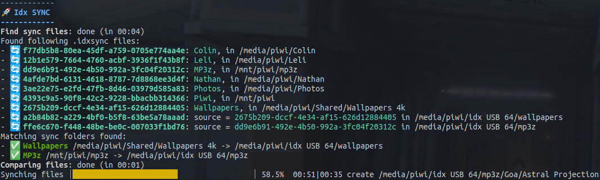

# Idx SYNC (incubation)

(!) Incubation project - not yet reliable.



## Description

Idx Sync is a folder-synchronization/backup tool that can automatically detect synchronizable folders (sources and
targets)
in the connected file systems / media devices (USB drives, external harddisks) and perform one-way synchronization for
backup purposes.

The synchronization will detect added, modified and removed files, and perform the necessary file operations to
synchronize changes between folders.

## Build

To build this project:

with Gradle (default tasks: _clean build shadowJar_):

    gradle

with Maven (default tasks: _clean install_):

    mvn

## Usage

The generated shadow JAR file is an executable, self-contained Java command line tool.

```bash
Usage: java -jar idx-sync-shadow.jar [command] [args]...
Commands:
- run   : Synchronize files (default task when no arguments are provided)
- scan  : Scan for sync files and show matching pairs
- source: [path] [name]: add the given path as a source with the given name
- target: [path] [source-folder-id]: add the given path as a target for the source with the given id
- remove: [path] remove the given path as source or target folder (deletes the .idxsync file)
```

## Maintenance

To check for updated dependency versions, run:

    gradle dependencyUpdates