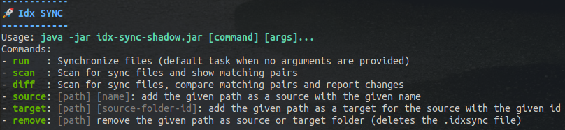

# Idx SYNC (incubation)

(!) Incubation project - not yet reliable.


## Description

Idx Sync is a folder-synchronization/backup tool that can automatically detect synchronizable folders (sources and
targets) in the connected file systems / media devices (USB drives, external harddisks) and perform one-way
synchronization for **backup** purposes.

The synchronization will:

- **scan the file system** for synchronization **source** and **target folders** (autodetection even in removable media)
- **find matching sync pairs** (target folders whose source folders are mounted)
- **detect added, modified and removed files**
- perform the necessary file operations to **synchronize changes between folders**.
- **report** how many files were created, updated, deleted, how much data was transferred and any errors that occurred.

## Usage

The generated shadow JAR file is an executable, self-contained Java command line tool.

If you run it with an unknown command (e.g. `help`) or the incorrect number of arguments, it will reveal its usage
information:

```bash
java -jar idx-sync.jar help
```



## Idx Sync Files

The source and target folders are marked by adding an `.idxSyncFile` in **YAML format**.

### For source folders:

```yaml
folder-id: 4ec2840b-e80b-4498-a2cd-820f283ba2e0
folder-name: BACKUP Dev
exclude-patterns:
- '**/node-modules'
- '**/.git'
- '$RECYCLE.BIN'
- 'System Volume Information'
include-hidden: false
tags:
  - BACKUP
  - DEV
  - DAILY
```

- `folder-id`: Unique identifier of a folder, preferrably a **UUID**
- `folder-name`: Display name of the folder
- `exclude-patterns`: Ant-style patterns for folders/files to exclude
- `include-hidden`: Whether hidden files should be included (default: `false`)
- `tags`: Optional list of tags

### For target folders:

```yaml
source-folder-id: 4ec2840b-e80b-4498-a2cd-820f283ba2e0
```

- `source-folder-id`: Id of the source folder from where files are synchronized

## Upcoming features

The following features are not yet implemented and are subject to an upcoming release:

- **Filtering**: filter files by their specified `exclude-patterns` and `include-hidden`
- **Tags**: allow selecting folders to be synchronized by `tags`.

## Build

To build this project:

with Gradle (default tasks: _clean build shadowJar_):

    gradle

with Maven (default tasks: _clean install_):

    mvn

## Maintenance

To check for updated dependency versions, run:

    gradle dependencyUpdates
